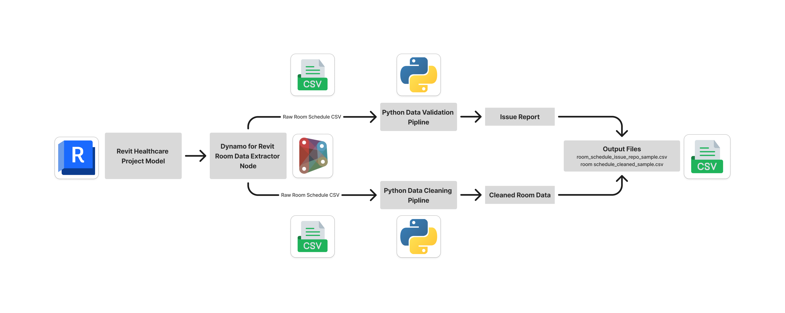
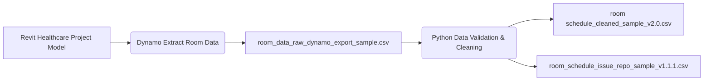

# Room Data Extractor (Revit + Dynamo + Python)

A portfolio project demonstrating automated **room schedule extraction and data cleaning pipeline** for AEC/BIM workflows.


---


## Recent progress(2-week development update)

 - Implemented room data export from Revit using Dynamo
 - Built Python data pipeline: read -- validate -- cleanup -- export
 - Added regex-based level extraction and numeric coercion
 - Included sample raw & cleaned room schedules for future reproducibility


---

## Design Decisions

 - Dynamo was used for **BIM parameter extraction** due to its Revit API access and node-based automation.
 - Direct Revit schedule was tested as a **comparison baseline** to verify extraction completeness. 
 - Python cleanup scripts standardize **Level values**, remove invalid rows, and generate validation logs.


## Workflow Overview 


**Revit Healthcare Project -- Dynamo Room Schedule Extraction -- Raw CSV -- Python Pipeline -- Validated & Cleaned Room Data**


This project includes:

- Dynamo script for room data extraction from Revit

- Python scripts for:

	1. Data cleanup (regex + numeric coercion)
	2. Data validation & issue reporting
	3. Versioned pipeline iterations

- Sample raw and cleaned datasets for reproducibility

- Structured for portfolio growth and future reuse


##  Portfolio Folder Structure

```
RoomDataExtractor/
    ├── RoomDataExtractor_v1.0/
    │   ├── assets/
    │   │   └── workflow_diagram.png
    │   ├── data/
    │   │   ├── raw/
    │   │   │   ├── room_data_raw_dynamo_export_sample.csv
    │   │   │   └── room_data_raw_revit_export_sample.csv
    │   │   └── clean/
    │   │       └── room_data_cleaned_sample_v1.0.csv
    │   ├── dynamo/
    │   │   └── room_extractor_v1.0.dyn
    │   ├── scripts/
    │   │   └── room_schedule_cleanup_v1.0.py
    │   └── README.md
    ├── RoomDataExtractor_v2.0/
    │   ├── assets/
    │   │   └── workflow_diagram.png
    │   ├── data/
    │   │   ├── raw/
    │   │   │   └── room_data_raw_dynamo_export_sample.csv
    │   │   └── clean/
    │   │       └── room schedule_cleaned_sample_v2.0.csv
    │   ├── scripts/
    │   │   └── room_schedule_cleanup_v2.0.py
    │   └── README.md
    └── RoomDataExtractor_v3.0/
        ├── assets/
        │   └── workflow_diagram.png
        ├── data/
        │   ├── raw/
        │   │   └── room_data_raw_dynamo_export_sample.csv
        │   ├── clean/
        │   │   └── room schedule_cleaned_sample_v3.0.csv
        │   └── issue_report/
        │       └── room_schedule_issue_repo_sample_v3.0.csv
        ├── scripts/
        │   └── room_schedule_cleanup_v3.0.py
        └── README.md
```

---


## Version History

- **v1.0** - Initial Dynamo room extraction + first Python room data cleanup script
- **v2.0** - Improved cleanup logic. Structured sample data is added
- **v3.0** - Introduced validation & issue reporting, refactored pipeline for future reuse


## Workflow Diagram

### PNG Version



### Mermaid Version



## Data Cleaning Rules Implemented

- Remove invalid placeholder data: **"Not Placed"**, **"Redundant Room"**, **"Unassigned"**, **"N/A"**

- Standardize **"Level"** column: 

	- Remove prefix in front of level numbers: 

		1. Extract integer from \*\*"Level"\*\* column by capturing 'Level x' pattern only
		2. Convert extracted level into numeric values using 'pandas.to\_numeric(..., errors='coerce')'

	- Remove invalid rows where level column is not a number

- Trim unnecessary whitespaces

- Export clean room schedule for reuse


## Validation \& Issue Reporting Features

- Reports missing data 

- Reports invalid placeholder data

- Identifies non-numeric or malformed rows

- Identifies unrealistic numbers:
	- Level \& Area (SF) showing as negative number or unrealistic for healthcare projects

- Identifies duplicate room numbers \& room number + level combo

- Outputs a structured issue log for debugging

- Reproducible across future CSV schedules


## How to Run This Project

### 1. Extract Room Schedule CSV File from Revit Dynamo

- Open 'room_extractor_v1.0.dyn' file in Dynamo
- Connect to the target Revit model
- Run extraction node to export room schedule into CSV sample


### 2. Clean Room Data in Python

- Run 'room_cleanup_v1.1.py' file in Python. Make sure **Pandas** can work at the same time


### 3. Validate Cleaned Data and Generate Issue Report

Run 'room_validation_issue_repo_v1.1.1.py'


--- 


## Future Improvements

- Add UI dashboard for room validation
- Extend support to multiple CSV schemas
- Convert pipeline into reusable package for AEC automation


---


## Portfolio Notes

Built by Lucienne (Huichao) Dong - Architectural Designer transitioning into AEC data and emerging tech workflows.