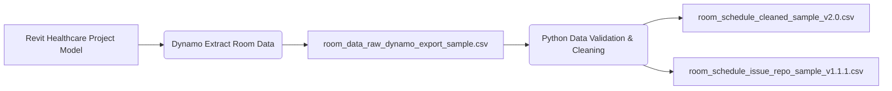

# Room Data Extractor v1.0


Automated room schedule extraction and data pipeline for BIM/AEC portfolio


---


## Workflow Diagram

### PNG Version


### Mermaid Version




---


## Folder Contents


### Includes: 

 - **Dynamo extraction script**
 - **Python cleanup pipeline**
 - **Sample datasets for reproducibility**


---


## Sample Data


**Input Samples:**

./data/raw/room_data_raw_dynamo_export_sample.csv

./data/raw/room_data_raw_revit_export_sample.csv


**Clean Output:**

./data/clean/room_data_cleaned_sample_v1.0.csv


---


## How to Run


```bash

python ./scripts/room_extractor_v1.0.py

```


---


## Portfolio Notes


Built by Lucienne (Huichao) Dong - Architectural Designer transitioning into AEC data and emerging tech workflows.

