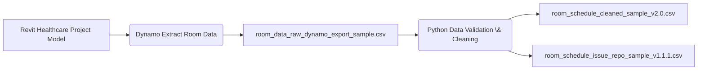

# Room Data Extractor v3.0


Automated room schedule extraction and data pipeline for BIM/AEC portfolio


---


## Workflow Diagram

### PNG Version


### Mermaid Version




---


## Folder Contents

### Includes: 

 - **Dynamo extraction script**
 - **Python cleanup pipeline**
 - **Room validation \& issue reporting**
 - **Sample datasets for reproducibility**


---


## Sample Data


**Input Samples:**

./data/raw/room_data_raw_dynamo_export_sample.csv

**Clean Output:**

./data/clean/room_data_cleaned_sample_v2.0.csv


**Issue Report:**

./scripts/room_validation_issue_repo_v1.1.1.py


---

## How to Run

```bash

python ./scripts/room_validation_issue_repo_v1.1.1.py

```
---

## Portfolio Notes

Built by Lucienne (Huichao) Dong - Architectural Designer transitioning into AEC data and emerging tech workflows.

###### 

###### 

###### Updates on v3.0


* add data validation including: missing data, invalid placeholder text (not placed, redundant room, unassigned, N/A), invalid area format
* export data issue repo to user selected location for further review

###### Updates on v3.1


**Issues found from reviewing the issue repo from v3.0:**

* Invalid Level Format are flagging valid rows from the raw data, like""90-3 - Level 1"". Detection is not precise.
* rooms having more than one kind of issue appears multiple times. data issue repo needs consolidation


**What are fixed in v3.1:**

* fix bad detection on Level number. only include invalid level number data in the issue repo
* consolidate the issue repo. show all the issues one item has on one row
